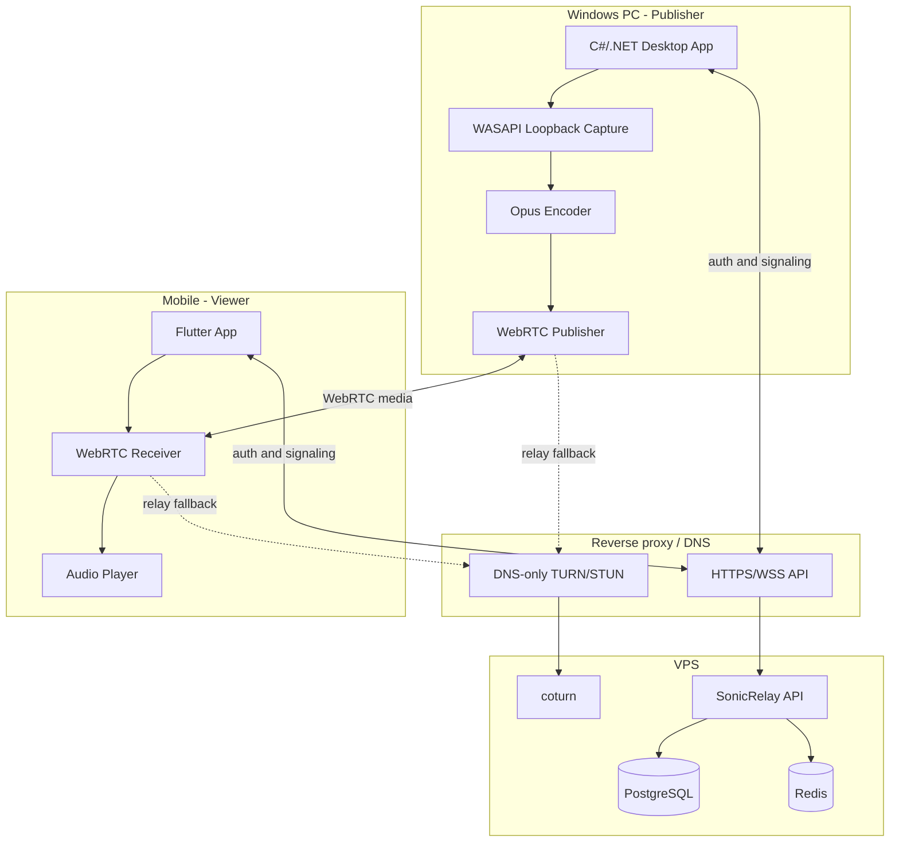
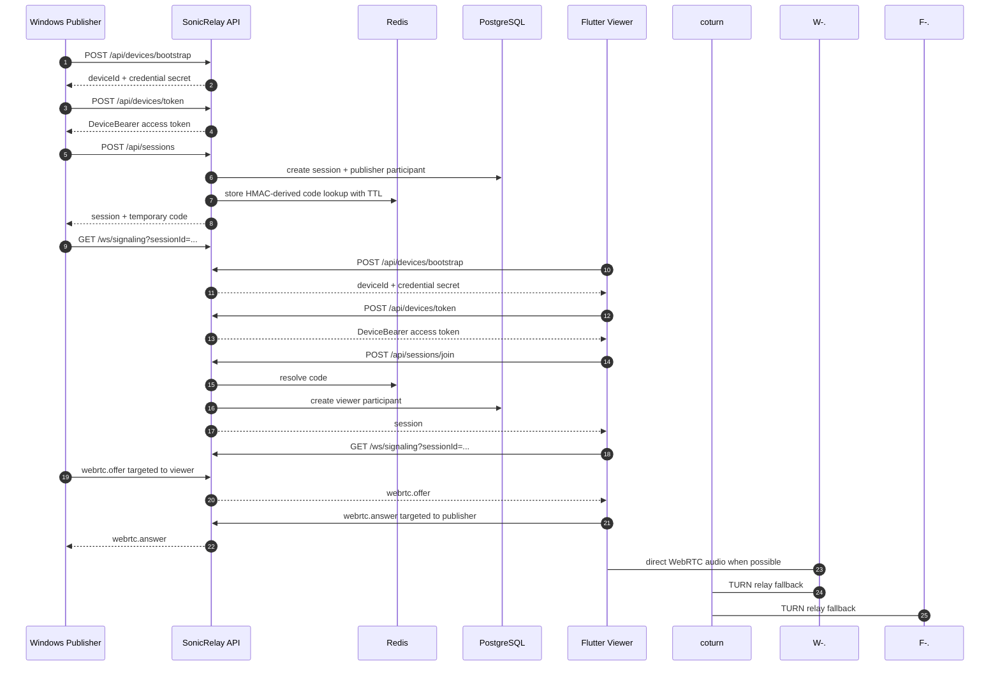
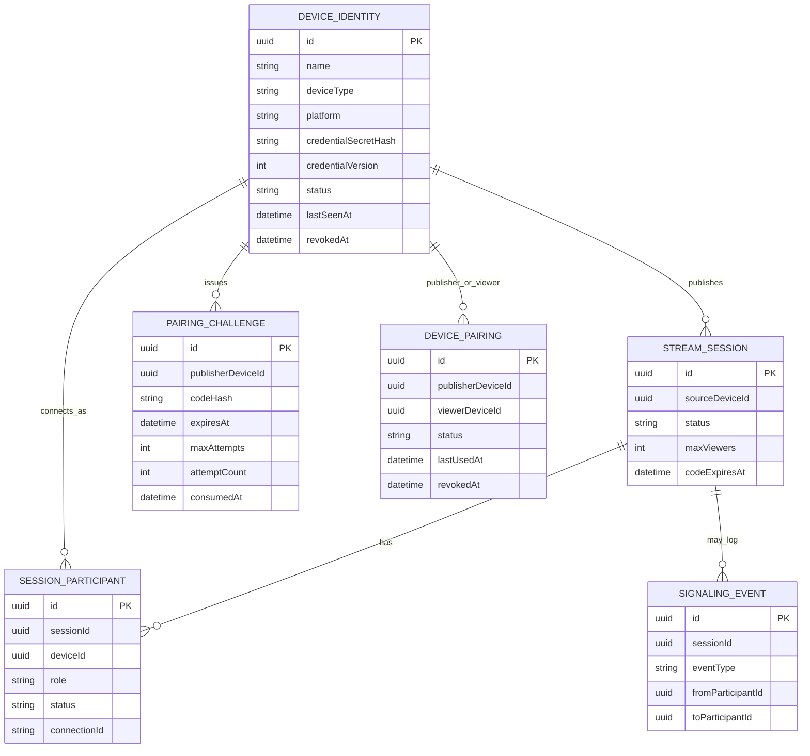
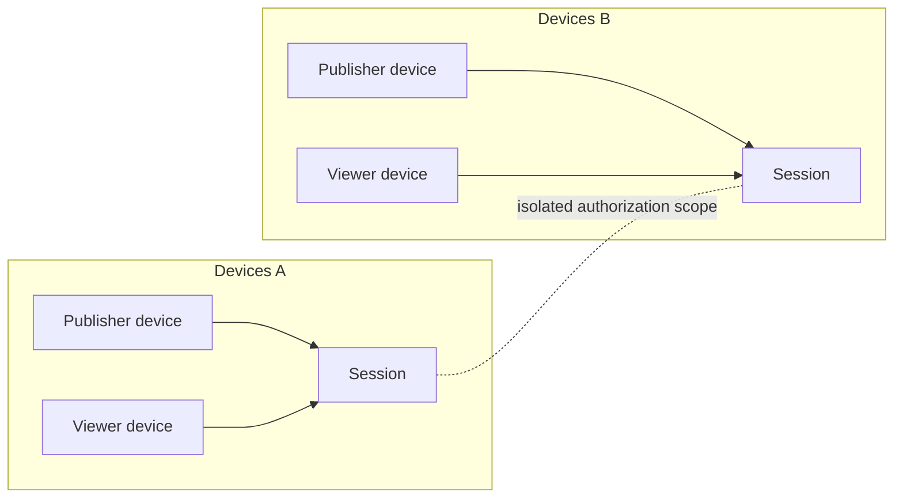
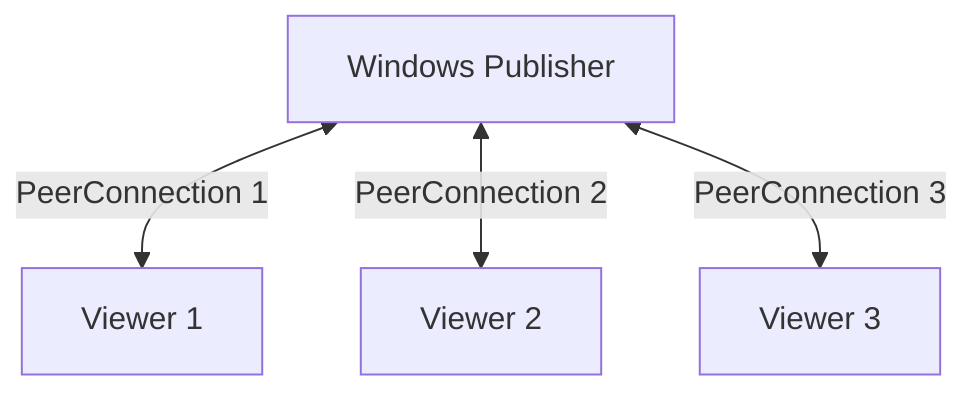

# Architecture

## System boundary

SonicRelay is a control plane. It authenticates users, persists session state, issues temporary join codes and routes WebRTC signaling messages. It does not capture, encode, buffer, transcode or relay audio. Media flows directly between clients when possible and through coturn when NAT traversal requires it.

## Components

- `services/SonicRelay.Api`: Minimal API composition, rate limits, health checks, endpoint handlers, WebSocket signaling and session cleanup.
- `src/SonicRelay.Domain`: device-identity credential/pairing, session, participant and signaling-event models — see `docs/device-identity.md`. `StreamSession.SourceDeviceId` and `SessionParticipant.DeviceId` reference `DeviceIdentity`. ASP.NET Core Identity and the old owner-scoped `Device` entity were removed in Phase 4 of issue #26 (see [ADR 0006](adr/0006-remove-identity.md)); `SonicRelay.Domain.Devices` now only holds the `DeviceTypes`/`DevicePlatforms` constants shared with `DeviceIdentity`.
- `src/SonicRelay.Application`: abstractions for session-code storage and live connection routing.
- `src/SonicRelay.Infrastructure`: EF Core/PostgreSQL persistence, Redis session-code storage and the in-memory connection registry.
- `infra`: development and full-stack production Compose definitions, nginx and coturn configuration.
- `deploy`: API-only production Compose file and SSH deployment script used by GitHub Actions.

The signaling registry is process-local. Multiple API replicas do not share live WebSocket registrations, so horizontal scaling requires sticky routing or a distributed signaling backplane.

## Primary flow

Each device bootstraps its own persistent credential and exchanges it for a short-lived `DeviceBearer` JWT; there is no human account. Session creation and join validate the caller's own device identity from its `DeviceBearer` token; nothing about which device is calling is client-asserted. Device pairing (Publisher issues a pairing challenge/QR, Viewer completes it) is a separate, independent flow used to let a Viewer discover and trust a Publisher's devices; it is not a prerequisite for creating or joining a session with a join code.

See [device identity](device-identity.md) for the pairing flow's own sequence.

## Persistence model

EF Core maps these tables but does not declare relational foreign-key navigation constraints in `AppDbContext`; ownership and membership checks are enforced by handlers.

## Session and peer topology

A device only sees sessions it publishes or participates in. A publisher is expected to create one peer connection per viewer.

## Decision records

- [ADR 0001: Keep media outside the backend](adr/0001-control-plane-only.md)
- [ADR 0002: Use Identity opaque bearer tokens](adr/0002-identity-bearer-tokens.md) — superseded by ADR 0006
- [ADR 0003: Split durable and ephemeral storage](adr/0003-postgresql-and-redis-storage.md)
- [ADR 0004: Use authenticated WebSocket signaling](adr/0004-authenticated-websocket-signaling.md)
- [ADR 0005: Symmetric device credentials with a parallel DeviceBearer scheme](adr/0005-device-identity-credentials.md) — extended in Phase 2 to sessions, signaling and TURN credential issuance
- [ADR 0006: Remove ASP.NET Core Identity and owner-scoped Device CRUD](adr/0006-remove-identity.md)
