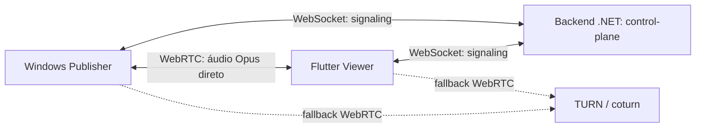
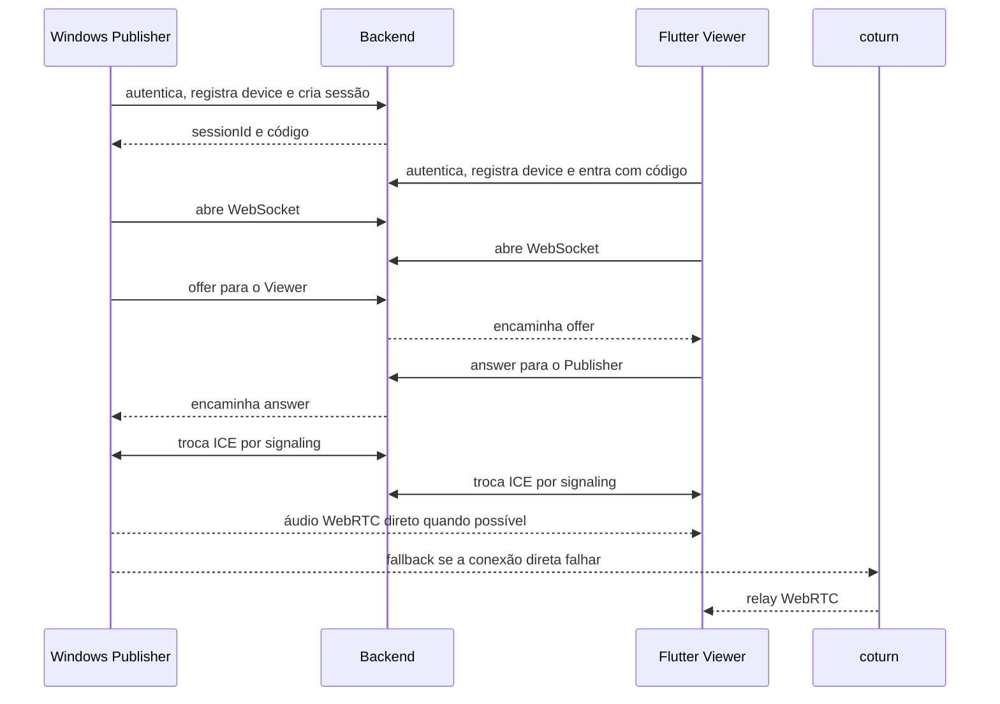

# Guia para leigos: WebSocket, WebRTC, signaling, Opus e arquitetura

Este guia explica o projeto sem pressupor experiência com protocolos realtime. Para implementar um client, use também o [contrato técnico do protocolo](protocol.md), que é a referência normativa.

## 1. O que é o SonicRelay?

SonicRelay conecta um computador Windows que publica áudio a celulares que o escutam com baixa latência. O sistema tem três peças:

- **Backend .NET Minimal API:** o control-plane; autentica, cria sessões e apresenta os participantes.
- **Windows Publisher:** captura o áudio, codifica com Opus pelo stack WebRTC e o envia.
- **Flutter Viewer:** recebe o áudio WebRTC e o reproduz.

O backend funciona como uma recepção de hotel: confere identidade, entrega o número da sala e apresenta as pessoas. Ele não participa da conversa dentro do quarto.

## 2. Mapa mental da arquitetura

Em uma frase: WebSocket combina como os clients conversarão; WebRTC transporta a conversa; coturn ajuda quando a rede impede o caminho direto.

## 3. WebSocket explicado para leigos

HTTP comum lembra enviar cartas: cada requisição recebe uma resposta e termina. WebSocket lembra manter uma chamada telefônica aberta, permitindo mensagens nos dois sentidos a qualquer momento.

No SonicRelay, cada client mantém um WebSocket autenticado com a API. Por ele passam somente mensagens pequenas de signaling, como offer, answer e ICE candidate. Nenhum áudio passa nesse socket.

## 4. WebRTC explicado para leigos

WebRTC é o conjunto de tecnologias que cria uma conexão de mídia de baixa latência entre peers. Ele negocia codecs, procura caminhos de rede, cifra o tráfego e transporta o áudio.

O caminho preferido é Publisher↔Viewer direto. Se NAT ou firewall impedir, os pacotes WebRTC podem passar pelo TURN/coturn. Mesmo nesse fallback, a Minimal API continua fora do caminho da mídia.

## 5. O que é Signaling?

Signaling é a troca de recados necessária para montar a conexão WebRTC. Imagine duas pessoas pedindo a um recepcionista para trocar cartões de contato antes de iniciarem uma chamada.

WebRTC não exige um protocolo de signaling específico. O SonicRelay escolheu envelopes JSON em WebSocket. A API autentica o remetente, confere se o destinatário está na mesma sessão e encaminha o payload.

## 6. SDP offer/answer explicado sem dor

SDP é uma descrição gerada pelo WebRTC sobre como um peer pode conversar: tipos de mídia, codecs e parâmetros. Não é áudio.

O Publisher cria uma **offer**: “estas são minhas opções”. O Viewer aplica a offer e cria uma **answer**: “esta é a combinação aceita”. As bibliotecas WebRTC geram e consomem o SDP; aplicações não devem concatená-lo ou editá-lo manualmente.

## 7. ICE candidate, STUN, TURN e coturn

Uma máquina pode ter vários endereços e estar atrás de roteadores. Um **ICE candidate** é uma rota possível para chegar a um peer, como uma lista de entradas alternativas para um prédio.

- **STUN:** informa ao client qual endereço público a internet enxerga. É descoberta, não relay.
- **TURN:** retransmite os pacotes quando nenhum caminho direto funciona.
- **coturn:** implementação open source de servidor STUN/TURN usada pela infraestrutura.

Os peers trocam candidates pelo signaling e testam as rotas. Isso se chama ICE. SDP/ICE podem revelar dados de rede e não devem ser registrados em logs.

## 8. Opus explicado

Opus é um codec: comprime áudio para gastar menos banda e o reconstrói no destino. Ele é adequado a áudio interativo e faz parte da negociação WebRTC.

No SonicRelay, Opus roda nos clients por meio do stack WebRTC. O backend não codifica, decodifica nem examina áudio.

## 9. Por que o backend não transmite áudio?

Manter mídia fora da API reduz latência, custo, carga e exposição de dados sensíveis. O ASP.NET Core fica focado em identidade, autorização, sessões e signaling.

Quando a conexão direta falha, coturn é o relay especializado. Transformar a API em media server duplicaria responsabilidades e não daria a ela os recursos de um SFU. O MVP usa uma peer connection por Viewer e não inclui SFU.

## 10. Spring Boot vs ASP.NET Core Minimal API

Spring Boot também seria uma escolha válida. .NET faz sentido aqui pela integração com o ecossistema Windows/.NET do Publisher e por permitir uma API enxuta; isso não torna Spring tecnicamente incapaz.

| Java/Spring | Equivalente no projeto .NET |
| --- | --- |
| Spring Boot app | ASP.NET Core app |
| `@RestController` | Minimal API endpoint/group |
| `@Service` | Serviço registrado no DI |
| JPA/Hibernate | EF Core/`DbContext` |
| `application.yml` | `appsettings.json` e variáveis de ambiente |
| Spring Security | ASP.NET Core Identity/Authorization |
| Filter/Middleware | ASP.NET Core Middleware |
| Actuator Health | ASP.NET Core HealthChecks |

A Minimal API organiza rotas com `MapGet`, `MapPost` e grupos em vez de controllers anotados. Serviços continuam sendo injetados por dependência, e EF Core cumpre papel semelhante ao JPA/Hibernate.

## 11. Glossário rápido

| Termo | Significado neste projeto |
| --- | --- |
| Control-plane | Backend que coordena identidade, sessão e signaling. |
| Media-plane | Caminho real dos pacotes de áudio WebRTC. |
| Publisher | App Windows que captura e publica áudio. |
| Viewer | App Flutter que recebe e toca áudio. |
| WebSocket | Canal persistente usado para signaling. |
| WebRTC | Transporte cifrado de mídia entre peers ou via TURN. |
| Signaling | Troca de metadados para criar a conexão WebRTC. |
| SDP | Descrição de capacidades negociada por offer/answer. |
| ICE candidate | Caminho de rede possível. |
| STUN | Descoberta do endereço público. |
| TURN/coturn | Relay de fallback para mídia WebRTC. |
| Opus | Codec de áudio executado nos clients. |
| SFU | Media server que encaminha streams; não faz parte do MVP. |

## 12. Fluxo completo do SonicRelay em linguagem simples

Em detalhes: os usuários autenticam e registram devices; o Publisher cria a sessão; o Viewer entra com o código; ambos abrem WebSockets; o backend anuncia a entrada do Viewer ao Publisher; `publisher.ready` e `viewer.ready` permitem que os lados aprendam os IDs autenticados; offer, answer e candidates passam pela API; depois o áudio segue pelo WebRTC direto ou via coturn. A API nunca recebe os frames de áudio.

## 13. O que estudar primeiro

1. Diferença entre HTTP e conexão WebSocket persistente.
2. Separação entre control-plane e media-plane.
3. Ciclo básico de `RTCPeerConnection`: offer, answer e descriptions.
4. ICE, NAT, STUN e TURN.
5. Tracks de áudio e Opus nas bibliotecas WebRTC dos clients.
6. Autenticação, lifecycle de sessão e erros do [protocolo SonicRelay](protocol.md).

Não comece implementando SDP manual ou um media server. Primeiro faça dois peers trocarem mensagens de signaling falsas; depois conecte WebRTC; por último integre captura e playback.

## 14. Erros comuns de iniciantes

- Achar que WebSocket transporta o áudio. Ele transporta apenas signaling.
- Achar que WebRTC substitui autenticação. A API ainda precisa autorizar sessão e participantes.
- Confundir SDP com mídia ou ICE candidate com pacote de áudio.
- Usar user ID, device ID ou session ID no campo `to`; o contrato espera participant ID.
- Presumir que STUN é relay. Quem faz relay é TURN/coturn.
- Logar tokens, códigos, SDP, ICE ou credenciais TURN.
- Criar uma única peer connection para vários Viewers sem um SFU. O MVP usa uma por Viewer.
- Tentar capturar WASAPI ou tocar Flutter no backend.
- Considerar signaling entregue como prova de conexão; os clients precisam observar os estados WebRTC.

## 15. Resumo final

O backend .NET é o control-plane e usa WebSocket para encaminhar signaling autenticado. Publisher e Viewer usam offer/answer, ICE, STUN e eventualmente TURN/coturn para montar o WebRTC. O áudio Opus segue no media-plane entre clients ou pelo relay especializado; o backend não o codifica, decodifica nem retransmite.

Regra de arquitetura: **Backend não codifica, decodifica nem retransmite áudio.**

Próximas leituras: [protocolo técnico](protocol.md), [arquitetura](architecture.md), [segurança](security.md) e [ADR do control-plane](adr/0001-control-plane-only.md).
